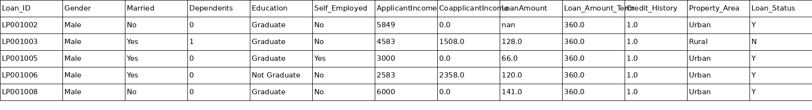
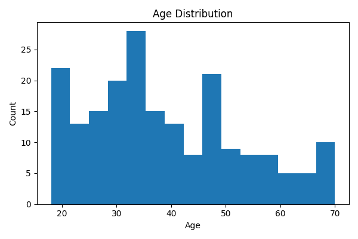
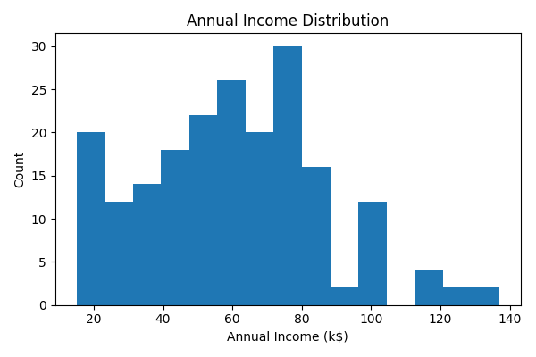
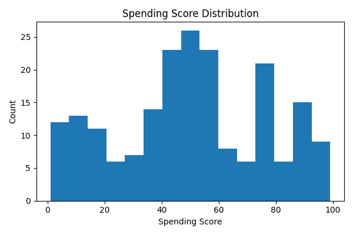
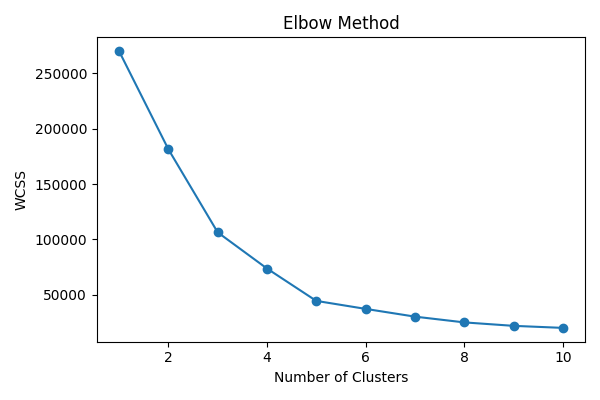
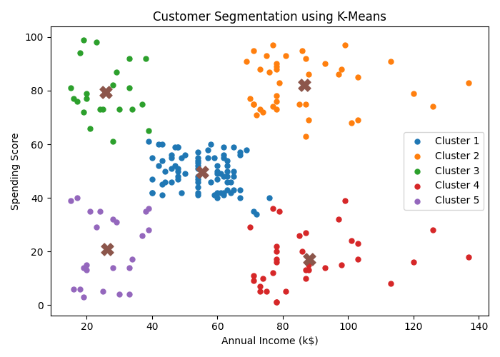
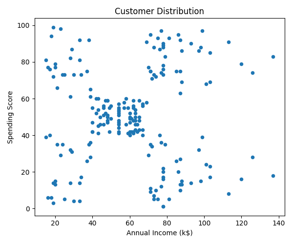

# Loan Approval Prediction

## Project Overview
This project predicts whether a loan application will be approved based on applicant information using machine learning classification techniques.

## Objective
- Predict loan approval status.
- Perform data preprocessing and feature engineering.
- Train and evaluate a machine learning classification model.

## Technologies Used
- Python
- Pandas
- NumPy
- Matplotlib
- Seaborn
- Scikit-learn
- Google Colab

## Machine Learning Algorithm
- Classification Model

## Project Workflow
1. Data Loading
2. Data Cleaning
3. Exploratory Data Analysis
4. Feature Engineering
5. Model Training
6. Model Evaluation
7. Prediction

## Project Outcome
The model predicts loan approval based on applicant details and demonstrates the use of supervised machine learning for classification problems.

# Loan Approval Prediction

## Project Overview
This project predicts whether a loan application will be approved based on applicant information using machine learning classification techniques.

## Objective
- Predict loan approval status.
- Perform data preprocessing and feature engineering.
- Train and evaluate a machine learning classification model.

## Technologies Used
- Python
- Pandas
- NumPy
- Matplotlib
- Seaborn
- Scikit-learn
- Google Colab

## Machine Learning Algorithm
- Classification Model

## Project Workflow
1. Data Loading
2. Data Cleaning
3. Exploratory Data Analysis
4. Feature Engineering
5. Model Training
6. Model Evaluation
7. Prediction

## Project Outcome
The model predicts loan approval based on applicant details and demonstrates the use of supervised machine learning for classification problems.

---
Created by Anushka G

## 📸 Project Screenshots

### Dataset Preview

### Age Distribution

### Annual Income Distribution

### Spending Score Distribution

### Elbow Method

### Customer Segmentation

### Customer Distribution

---
Created by Anushka G
